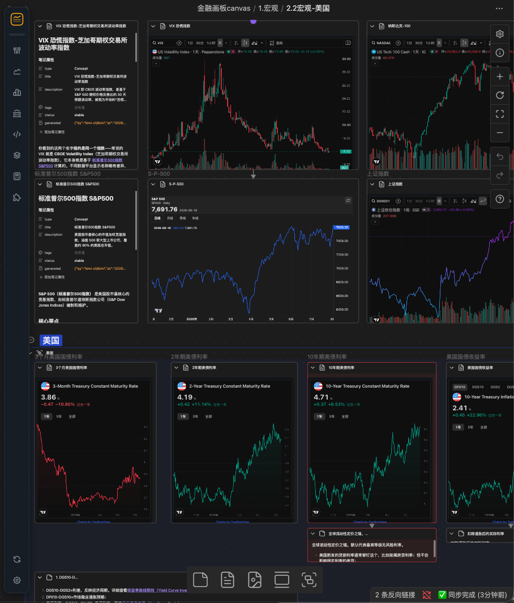

  

<h1 align="center">StrataBoard · Financial Canvas</h1>

  把金融数据卡片放上 Obsidian Canvas —— 行情、宏观、组件，一板尽览。 
  

> **免责声明**：本插件仅作为数据展示工具，所有第三方接口均由用户自行配置/调用，数据版权归原平台所有，不得用于商业用途。本插件仅提供数据接入框架，用户需自行遵守各数据平台的服务条款。

## 白板一览

自由在 Canvas中组合数据卡片：

## 演示

**插入数据** —— 搜索符号（支持名称/代码），选中即建卡并放上画布：

**插入 FRED 宏观数据卡** —— 直接搜索 FRED 序列（如美债收益率）建卡：

**插入 TradingView 小组件** —— 从 TradingView Widgets 页面复制嵌入代码即可建卡：

## 功能

**卡片类型**

- **资产行情卡**：股票/基金/指数/宏观 等数据。支持日/周/月周期，不支持高频数据。
- **数据叠加卡**：多序列同图对比
- **数据计算卡**：对序列做简单的四则运算
- **TradingView 小组件卡**：可以直接在ob内插入TradingView Widgets组件。
- **日历**：基础日历功能。

## 安装

本插件已上架obsidian**社区插件市场**。

### 方式一：从obsidian社区插件市场中下载（推荐）

1. 打开设置-第三方插件-关闭安全模式
2. 社区插件市场搜索 “StrataBoard”

### 方式二：下载 Release

1. 从 [Releases](../../releases/latest) 下载 `main.js`、`manifest.json`、`styles.css`、`sql-wasm.wasm` 四个文件。
2. 在你的库目录下新建文件夹 `.obsidian/plugins/strataboard/`，把四个文件放进去。
3. 重启 Obsidian，在 设置 → 第三方插件 中启用 **StrataBoard**。

**出于法律风险，本插件不再提供免费数据源，首次使用需用户自行配置数据源（问AI）。或者使用付费数据源（目前支持Tushare）**

## 使用

### 建卡入口：
- 在obsidian原生canvas画布上使用**浮动工具栏**
- 在普通的 Markdown 文档中右键「插入金融卡片」

### 日常使用
- 拖动卡片标题移动卡片；双击进入图表交互模式（滚轮缩放、拖动平移），再次双击打开统合编辑弹窗——周期、时间范围、图表类型、主题、涨跌色、卡片高度都按卡片独立保存。
- 熟悉格式后也可以直接编辑卡片文件里的 YAML，保存即生效。
- 数据缓存在本地 SQLite，只增量拉取新数据；点卡片右上角的刷新按钮强制更新，或在设置中打开「自动刷新」。
- 叠加卡把多条序列（行情 / 宏观 / FRED，甚至另一张卡片）画进同一张图；计算卡用字母引用各序列写四则表达式，如 `A-B`、`(A+B)/2`。
- 不再需要的数据可以在 设置 → 路径设置 → 清理维护 里扫描并清理孤儿卡片文件与过期缓存。

## 数据源
**出于法律风险和技术礼貌，本插件不再支持内置任何免密钥接口，需用户自行配置免费数据源。本插件不支持高频数据获取。仅支持日线级别的数据，方便分析和学习使用。**

- Tushare Pro（收费数据源）：A 股/基金/指数/港股/可转债/期货/外汇/申万行业/南华指数/中国宏观
- FRED（免费数据源但需要申请）：美联储宏观序列，支持服务端单位变换（环比/同比/对数…）
- 自定义数据源：在设置页自行配置任意 RESTful 行情接口（URL 模板 + 响应格式）

### 自定义数据源

插件不内置任何免密钥行情接口。你可以在 设置 → 数据源设置 → 自定义数据源 中自行添加任意返回 JSON 的 RESTful 行情接口，添加后即可像其他数据源一样建独立卡，也可用于叠加卡与计算卡。

每个数据源需要填写：

- **名称**：显示在选择器、工具栏与卡片文件名中
- **响应格式**：腾讯格式 / 东方财富格式 / 通用 JSON（见下）
- **K 线接口 URL**：支持占位符 `{code}`（代码）、`{start}` / `{end}`（YYYYMMDD）、`{endIso}`（YYYY-MM-DD）
- **搜索接口 URL**（可选）：支持占位符 `{query}`；留空则该源只能手工录入代码建卡
- **通用 JSON 映射**（仅通用 JSON 格式）：行数组路径（如 `data.klines`）、行类型（数组按列序号 / 对象按字段名）、日期与开高低收/成交量/成交额的列位置，以及可选的搜索结果映射

## 网络请求说明

本插件需要联网获取数据，仅在你使用对应功能时向以下服务发起请求：
| 服务 | 域名 | 说明 |
| --- | --- | --- |
| Tushare Pro | `api.tushare.pro` | A 股/港股/期货/宏观等数据，使用你自己配置的 Token |
| FRED | `api.stlouisfed.org` | 美联储宏观序列，使用你自己配置的 API Key |
| 自定义数据源 | 由你配置的接口地址决定 | 插件不内置任何免密钥接口，仅按你在设置页填写的 URL 发起请求 |
| TradingView | `*.tradingview.com` | 仅 TradingView 小组件卡加载其第三方脚本 |

除上述数据源外，插件不会向任何其他服务器发送数据；你的 Token、API Key 与全部缓存数据仅保存在本地。

## 免责声明
- **本插件仅作为数据展示工具，所有第三方接口均由用户自行配置/调用，用户需自行遵守各数据平台的服务条款。数据版权归原平台所有，不得用于商业用途。**
- **本插件仅供个人学习与研究使用，不构成任何投资建议。**
- Tushare、FRED 等数据源需使用你自己的账号与密钥，使用时请遵守各平台的服务条款。
- **FRED**：This product uses the FRED® API but is not endorsed or certified by the Federal Reserve Bank of St. Louis.
- 插件目前仅支持桌面端 Obsidian。

## License
MIT（见 [LICENSE](LICENSE)）。第三方依赖的许可见 [THIRD-PARTY-LICENSES.md](THIRD-PARTY-LICENSES.md)。

## Buy me a 奶茶吧～（赞赏 / 打赏）

如果这个插件对你有帮助，可以请我喝杯奶茶：

| 微信赞赏码 | 支付宝赞赏码 |
| :---: | :---: |
|  |  |
