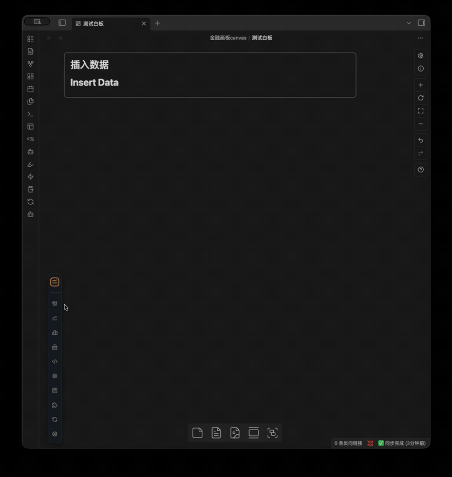
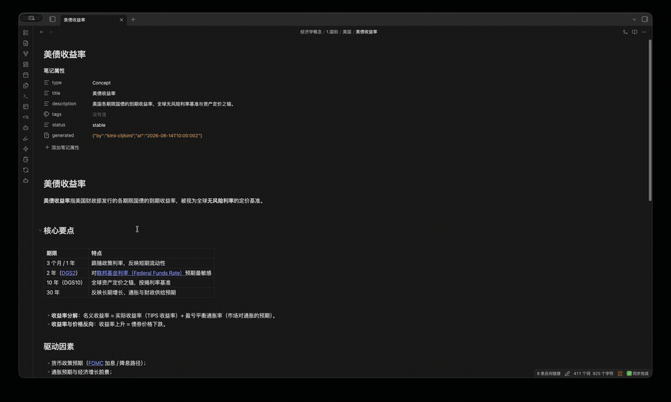
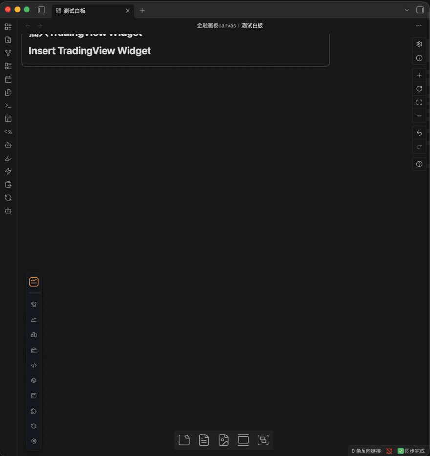

<p align="center">
  
</p>

<h1 align="center">StrataBoard · Financial Canvas</h1>

<p align="center">
  把金融数据卡片放上 Obsidian Canvas 白板——行情、宏观、组件，一板尽览。<br>
  仅支持桌面端 Obsidian。
</p>

## 演示

**插入资产卡片** —— 搜索符号（支持名称/代码），选中即建卡并放上画布：



**插入 FRED 宏观数据卡** —— 直接搜索 FRED 序列（如美债收益率）建卡：



**插入 TradingView 小组件** —— 从 TradingView Widgets 页面复制嵌入代码即可建卡：



## 功能特性

**卡片类型**（每张卡片就是一个 Markdown 文件，YAML 即配置，可直接编辑）

- 资产行情卡：K 线 / 折线，日/周/月周期
- 宏观数据卡：中国宏观（CPI/PMI/社融/国债收益率曲线…）与 FRED 序列
- 数据叠加卡：多序列同图对比
- 数据计算卡：对序列做四则运算（如 `A-B`、`(A+B)/2`）
- TradingView 小组件卡、日历卡（联动日记）、时间线卡

**数据源**

- Tushare Pro：A 股/基金/指数/港股/可转债/期货/外汇/申万行业/南华指数/中国宏观
- FRED：美联储宏观序列，支持服务端单位变换（环比/同比/对数…）
  - This product uses the FRED® API but is not endorsed or certified by the Federal Reserve Bank of St. Louis.
- 腾讯行情、东方财富：免密钥，覆盖 A 股/港股/美股/指数/ETF

**其他**

- 画布浮动工具栏：图标/文字两种样式，图标大小、按钮排序、宽度、位置均可自定义
- 本地 SQLite 缓存（sql.js WASM），增量更新，离线可读
- 所有数据源均可从「插入资产数据」入口直达各自选择器，也可用于叠加卡与计算卡

## 安装

本插件尚未上架社区市场，从 Release 安装或自行构建：

**方式一：下载 Release（推荐）**

1. 从 [Releases](../../releases/latest) 下载 `main.js`、`manifest.json`、`styles.css`、`sql-wasm.wasm` 四个文件。
2. 在你的库目录下新建文件夹 `.obsidian/plugins/strataboard/`，把四个文件放进去。
3. 重启 Obsidian，在 设置 → 第三方插件 中启用 **StrataBoard**。

**方式二：从源码构建**

```bash
git clone https://github.com/lichliar/strataboard.git
cd strataboard
npm install
OBSIDIAN_PLUGIN_DIR=/path/to/your-vault/.obsidian/plugins/strataboard npm run build
```

启用后在插件设置中填入 Tushare Token（以及可选的 FRED API Key）。

## 使用

建卡入口任选其一：

- 画布上的浮动工具栏（按数据源分组）
- 命令面板：插入金融卡片 / 插入资产叠加卡 / …
- 画布空白处右键菜单
- Markdown 编辑器右键「插入金融卡片」（在光标处写入代码块）

每张卡片是 `金融卡片/`（可在设置中修改）下的一个 Markdown 文件，内容为一个代码块，例如：

    ```tushare
    symbol: 600519.SH
    type: stock
    freq: D
    range: 1y
    chartType: candlestick
    ```

双击卡片进入图表交互模式，再次双击打开统合编辑弹窗（周期/时间范围/图表类型/主题/涨跌色/高度均按卡片独立保存）。

## 设置

插件设置分为四个标签页：

- **数据源设置**：Tushare Token（含接口积分要求速查）、FRED API Key、免费行情源说明、股票列表刷新间隔
- **路径设置**：图表卡片 / Widget / 组件 / 缓存文件夹
- **卡片与组件**：打开自动刷新、Widget iframe 高度、日历与时间线外观
- **工具栏设置**：位置、图标/文字样式、图标大小、按钮排序、各数据源显隐

## 开发

- `npm run dev` —— 监听模式构建（内联 sourcemap）
- `npm run build` —— 类型检查 + 生产构建 + 拷贝资源到插件目录
- `npm run version` —— 同步 manifest/versions 版本号
- `npm run release` —— 构建并发布 GitHub Release（推送分支、打 `vX.Y.Z` 标签、上传构建产物；需已认证 `gh`)

构建产物直接写入 `OBSIDIAN_PLUGIN_DIR` 指定的插件目录。代码结构与设计约定见 [AGENTS.md](AGENTS.md)。

## 网络请求说明

本插件需要联网获取数据，仅在你使用对应功能时向以下服务发起请求：

| 服务 | 域名 | 说明 |
| --- | --- | --- |
| Tushare Pro | `api.tushare.pro` | A 股/港股/期货/宏观等数据，使用你自己配置的 Token |
| FRED | `api.stlouisfed.org` | 美联储宏观序列，使用你自己配置的 API Key |
| 腾讯行情 | `smartbox.gtimg.cn`、`web.ifzq.gtimg.cn` | 代码搜索与 K 线，免密钥 |
| 东方财富 | `searchapi.eastmoney.com`、`push2his.eastmoney.com` | 代码搜索与 K 线，免密钥 |
| TradingView | `*.tradingview.com` | 仅 TradingView 小组件卡加载其第三方脚本 |

除上述数据源外，插件不会向任何其他服务器发送数据；你的 Token、API Key 与全部缓存数据仅保存在本地。

## 免责声明

- 本插件仅供个人学习与研究使用，不构成任何投资建议。投资有风险，入市需谨慎。
- 行情与宏观数据均来自第三方服务，可能存在延迟、错误或缺失，请以官方数据为准。
- 腾讯自选股与东方财富为未公开的非官方接口，随时可能变更或失效，稳定性不做任何保证。
- Tushare、FRED 等数据源需使用你自己的账号与密钥，使用时请遵守各平台的服务条款。
- This product uses the FRED® API but is not endorsed or certified by the Federal Reserve Bank of St. Louis.

## License

MIT（见 [LICENSE](LICENSE)）。第三方依赖的许可见 [THIRD-PARTY-LICENSES.md](THIRD-PARTY-LICENSES.md)。
