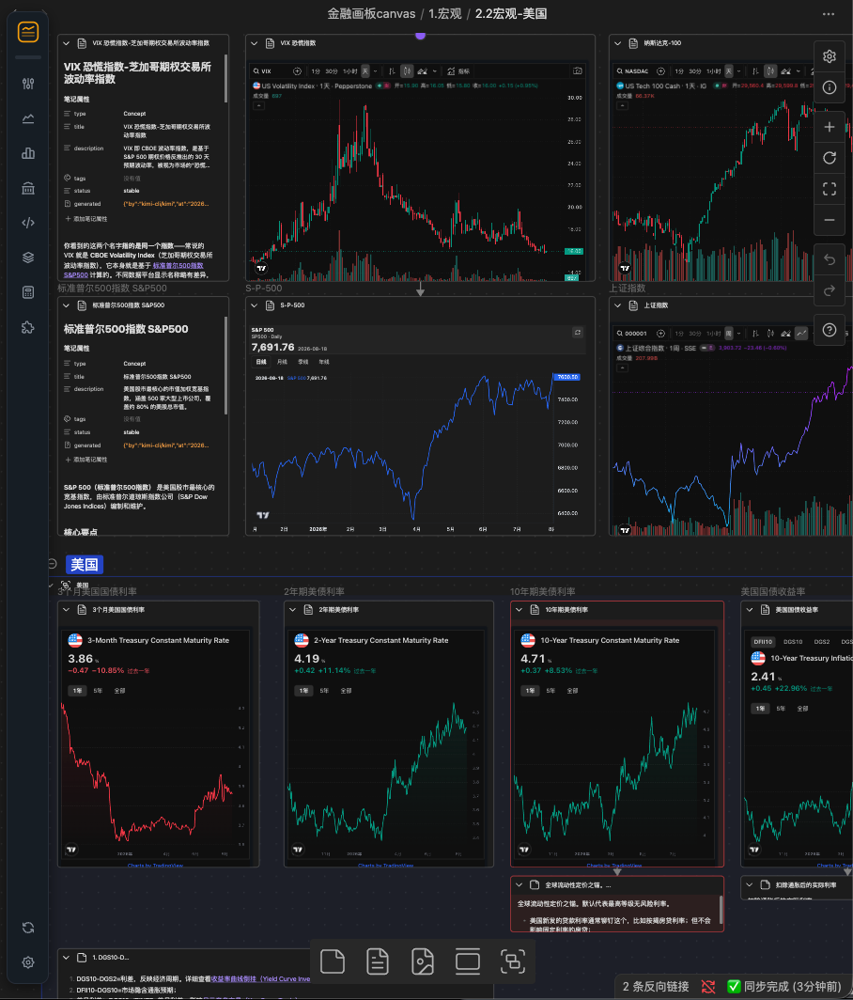
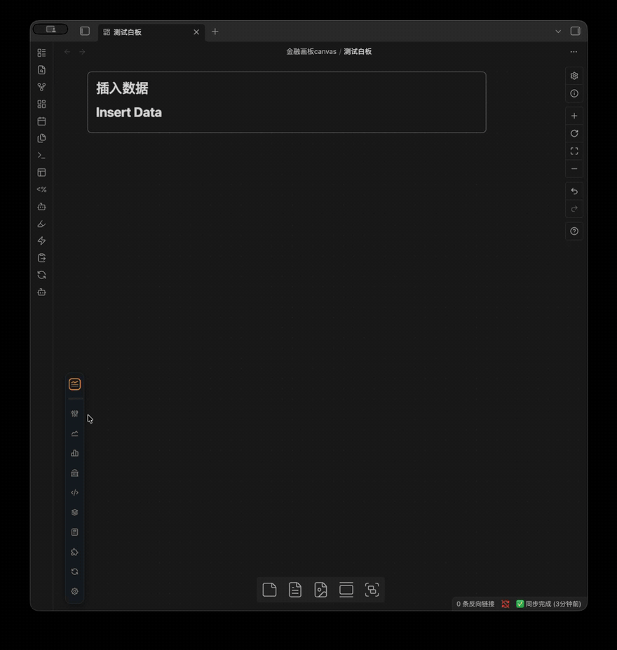
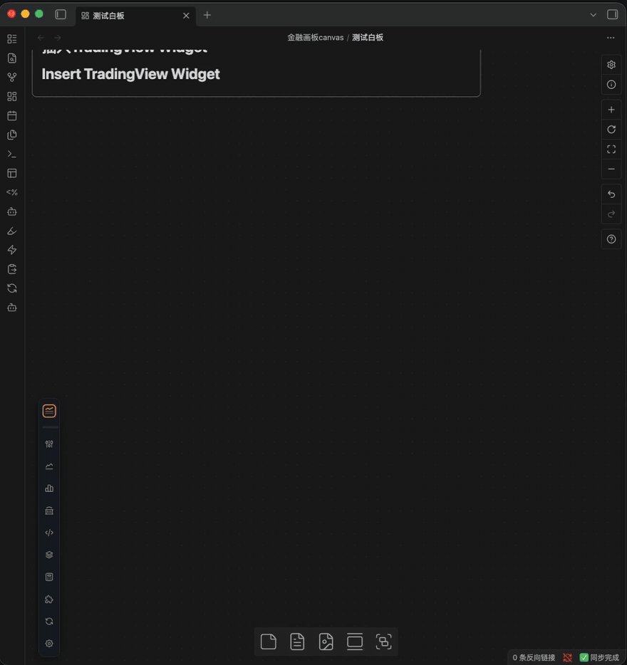

<p align="center">
  <picture>
    <source media="(prefers-color-scheme: dark)" srcset="docs/logo-text-dark.svg">
    
  </picture>
</p>

<p align="center">
  把金融数据卡片放上 Obsidian Canvas —— 行情、宏观、组件，一板尽览。<br>
  
</p>

> **免责声明**：本插件仅作为数据展示工具，所有第三方接口均由用户自行配置/调用，数据版权归原平台所有，不得用于商业用途。本插件仅提供数据接入框架，用户需自行遵守各数据平台的服务条款。

## 白板一览

自由在 Canvas中组合数据卡片：



## 演示

**插入数据** —— 搜索符号（支持名称/代码），选中即建卡并放上画布：



**插入 TradingView 小组件** —— 从 TradingView Widgets 页面复制嵌入代码即可建卡：



## 功能

**卡片类型**

- **资产行情卡**：由你配置的自定义数据源驱动（行情/宏观序列均可）。支持日/周/月周期，不支持高频数据。
- **数据叠加卡**：多序列同图对比
- **数据计算卡**：对序列做简单的四则运算
- **TradingView 小组件卡**：可以直接在ob内插入TradingView Widgets组件。
- **日历**：基础日历功能。

## 安装

本插件已上架obsidian**社区插件市场**。

### 方式一：从obsidian社区插件市场中下载（推荐）

1. 打开设置-第三方插件-关闭安全模式
2. 社区插件市场搜索 “StrataBoard”
3. 首次启用（或更新）时插件会自动从 GitHub release 下载资源文件（`sql-wasm.wasm` / `cli.js` / `mcp-server.js`）；若下载失败可按方式二手动补齐。

### 方式二：下载 Release

1. 从 [Releases](../../releases/latest) 下载 `main.js`、`manifest.json`、`styles.css`、`sql-wasm.wasm` 四个文件（需要 MCP/CLI 的话再下载 `cli.js`、`mcp-server.js`）。
2. 在你的库目录下新建文件夹 `.obsidian/plugins/strataboard/`，把文件放进去。
3. 重启 Obsidian，在 设置 → 第三方插件 中启用 **StrataBoard**。

**本插件不内置任何数据源，首次使用需自行配置数据接口（REST/JSON）或 vault 内的 CSV 文件——可以让 AI 辅助生成配置（无可用数据源时，「插入图表」会弹出设置引导）。**

## 使用

### 建卡入口：
- 在obsidian原生canvas画布上使用**浮动工具栏**
- 在普通的 Markdown 文档中右键「插入金融卡片」

### 日常使用
- 拖动卡片标题移动卡片；双击进入图表交互模式（滚轮缩放、拖动平移），再次双击打开统一的编辑弹窗——周期、时间范围、图表类型、主题、涨跌色、卡片高度都按卡片独立保存。
- 熟悉格式后也可以直接编辑卡片文件里的 YAML，保存即生效。
- 数据缓存在本地 SQLite，只增量拉取新数据；点卡片右上角的刷新按钮强制更新，或在设置中打开「自动刷新」。
- 叠加卡把多条序列（行情 / 宏观序列，甚至另一张卡片）画进同一张图；计算卡用字母引用各序列写四则表达式，如 `A-B`、`(A+B)/2`。
- 不再需要的数据可以在 设置 → 路径设置 → 清理维护 里扫描并清理孤儿卡片文件与过期缓存。

## 数据源
**本插件不内置任何数据源，仅作为数据接入框架与展示工具：所有数据都来自你在设置页自行配置的 REST/JSON 接口或 vault 内的 CSV 文件。本插件不支持高频数据获取，仅支持日线级别的数据，方便分析和学习使用。**

- 自定义数据源：在设置页自行配置任意 RESTful / JSON 数据接口（URL 模板 + 响应格式），或 vault 内的 CSV 文件
- 脚本产物 CSV：自己写的 Python 脚本把计算结果输出到脚本文件夹的 `output/` 子目录，插件自动注册为数据源（见下「脚本处理」）

### 自定义数据源

你可以在 设置 → 数据源设置 中自行添加任意返回 JSON 的 RESTful 数据接口（各类官方公开 API 一般都可按通用契约接入），添加后即可建独立卡，也可用于叠加卡与计算卡。

每个数据源需要填写：

- **名称**：显示在选择器、工具栏与卡片文件名中
- **响应格式**：内置常见行情 JSON 格式的自动识别，或通用 JSON 手动映射（见下）
- **K 线接口 URL**：支持占位符 `{code}`（代码）、`{start}` / `{end}`（YYYYMMDD）、`{startIso}` / `{endIso}`（YYYY-MM-DD）、`{apiKey}`（密钥）
- **请求方式**：GET（默认）或 POST；POST 时填写请求体模板（同一套占位符，自动带 `Content-Type: application/json`）
- **搜索接口**（可选）：GET 搜索填搜索 URL（占位符 `{query}`）；POST 搜索改填搜索请求体模板（`{query}` / `{apiKey}` 占位，URL 取搜索 URL、未配则复用 K 线 URL）；模板不含 `{query}` 时插件把整表拉回本地过滤（结果有缓存）。都不配则该源只能手工录入代码建卡
- **通用 JSON 映射**（仅通用 JSON 格式）：行数组路径（如 `data.klines`）、行类型（数组按列序号 / 对象按字段名 / `fields` 按列名数组寻址，如 `data.fields` + `data.items`）、日期与开高低收/成交量/成交额的列位置、可选的业务错误透传（`errorPath` / `errorMessagePath`），以及可选的搜索结果映射
- **兼容模式**（可选）：个别站点在 Obsidian 默认网络栈下连接失败时，改用 Node https 发送请求

### 脚本处理

自己写 Python 脚本做复杂数据计算，脚本把结果写成 CSV 放进脚本文件夹的 `output/` 子目录（建议与脚本同名：`脚本/foo.py` → `脚本/output/foo.csv`），插件自动把它注册为数据源——之后即可像其他数据源一样建独立卡、叠加卡、计算卡；产物更新后相关缓存自动失效、卡片自动重绘。

- **运行独立于插件**：插件不提供定时调度，需要定时请用 cron / launchd / 任务计划自己跑；也可以在 工具栏 → 数据处理 → 脚本处理（或命令面板「打开脚本管理」）里手动「立即运行」。想让 AI 帮忙写脚本：弹窗里「AI 辅助」提供一键复制的提示词（已附产物契约与合规规则），发给你自己的 AI 即可。
- **CSV 契约**：UTF-8、首行表头；两种格式二选一——宽表（推荐，首列是日期，其余每个数值列是一条序列，列名即代码，空值表示该日无数据）或单序列 OHLCV（表头含 `date,open,high,low,close`）。
- **合规边界**：脚本由用户自行编写与运行，脚本的数据获取行为及其与数据源之间的授权关系由用户负责，插件仅读取脚本产出的本地 CSV。脚本功能不适合高频数据、不作为批量下载工具；建议增量抓取、请求间隔 ≥ 1 秒。

## 用 AI Agent 操作本插件（MCP / CLI）

本插件不内置 AI 助手，但为你自己的 AI agent（Codex、Claude Code 等）提供两个入口，AI 可以直接查符号、列数据源、校验卡片、探测数据：

- **MCP server（推荐）**：以 stdio 方式在你的 AI agent 中注册 `node <插件目录>/mcp-server.js --vault <vault 路径>`。提供工具：`search_symbols` / `list_sources` / `validate_cards` / `probe_data` / `get_card_guide`。
- **CLI**：`node <插件目录>/cli.js <命令> [--vault <vault 路径>]`，命令有 `search` / `sources` / `validate` / `probe`，全部输出 JSON，适合脚本调用。

Codex 配置示例（`~/.codex/config.toml`）：

```toml
[mcp_servers.strataboard]
command = "node"
args = ["<插件目录>/mcp-server.js", "--vault", "<vault 路径>"]
```

其他 agent（JSON 配置）：

```json
{
  "mcpServers": {
    "strataboard": { "command": "node", "args": ["<插件目录>/mcp-server.js", "--vault", "<vault 路径>"] }
  }
}
```

插件目录即 `<vault 路径>/.obsidian/plugins/strataboard`；`--vault` 缺省时读环境变量 `STRATABOARD_VAULT`，再从当前目录向上查找含 `.obsidian` 的目录。设置页「AI 辅助」tab 里有接入配置片段（路径用 `<vault路径>` 占位符表示，需自行替换）、「一键配置提示词」（发给你的 AI agent，它会自动定位 vault 并完成 MCP 注册），以及按场景分类的提示词：添加数据源、编写/修改卡片（《StrataBoard 卡片编写指南》全文，可展开查看、一键复制；MCP 客户端可直接调用 `get_card_guide` 工具获取）、编写数据处理脚本。

## 网络请求说明

本插件需要联网获取数据，仅在你使用对应功能时发起请求：
| 服务 | 域名 | 说明 |
| --- | --- | --- |
| 自定义数据源 | 由你配置的接口地址决定 | 插件不内置任何数据接口，仅按你在设置页填写的配置发起请求 |
| TradingView | `*.tradingview.com` | 仅 TradingView 小组件卡加载其第三方脚本 |

除上述请求外，插件不会向任何其他服务器发送数据；你的 API 凭据与全部缓存数据仅保存在本地。

## 免责声明
- **本插件仅作为数据接入框架与展示工具，不内置任何数据源；所有第三方接口均由用户自行配置/调用，用户需自行遵守各数据平台的服务条款。数据版权归原平台所有，不得用于商业用途。**
- **本插件仅供个人学习与研究使用，不构成任何投资建议。**
- 自行配置的数据接口如需账号与密钥，使用时请遵守对应平台的服务条款。
- 插件目前仅支持桌面端 Obsidian。

## License
MIT（见 [LICENSE](LICENSE)）。第三方依赖的许可见 [THIRD-PARTY-LICENSES.md](THIRD-PARTY-LICENSES.md)。

## Buy me a 奶茶吧～（赞赏 / 打赏）

如果这个插件对你有帮助，可以请我喝杯奶茶：

| 微信赞赏码 | 支付宝赞赏码 |
| :---: | :---: |
|  |  |
